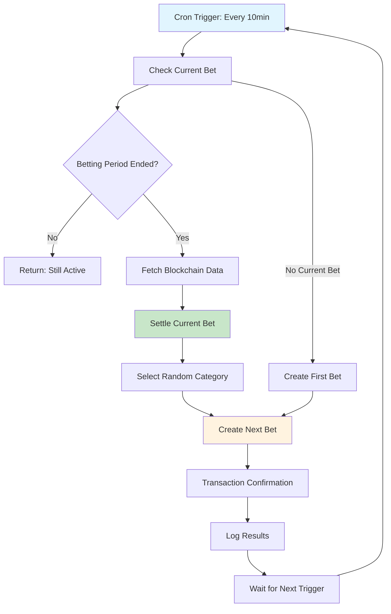

# Chain Chaos Automation Service

A standalone Node.js service that creates and settles bets automatically every 5 minutes using real Etherlink blockchain data.

## How It Works

1. **Automated Bet Creation**: Every 5 minutes, the service creates a new bet with a random category:
   - `base_fee_per_gas`: Sum of base fee per gas over 5 minutes
   - `burnt_fees`: Total burnt fees from 40-60 randomly sampled blocks
   - `gas_used`: Total gas used from 40-60 randomly sampled blocks  
   - `xtz_price`: XTZ price in USD cents at settlement time

2. **Data Collection**: 
   - Fetches block data from Etherlink Explorer API
   - Uses CoinGecko API for XTZ price data
   - Records all calculation methods and sampled blocks for transparency

3. **Automated Settlement**: When a bet's 5-minute window ends:
   - Calculates the actual result using the specified method
   - Stores metadata about which blocks were sampled
   - Settles the bet on the smart contract

## Quick Start

### Prerequisites
- Node.js 18+ 
- npm or yarn
- Contract deployed on Etherlink
- Private key with ETH for gas fees

### Environment Setup

Create a `.env` file:

```bash
# Network Configuration
IS_TESTNET=false  # Set to 'true' for testnet, 'false' for mainnet

# Required - Common
AUTOMATION_PRIVATE_KEY=your_private_key_here

# Required - Mainnet (when IS_TESTNET=false)
CHAIN_CHAOS_CONTRACT_ADDRESS=your_mainnet_contract_address_here

# Required - Testnet (when IS_TESTNET=true)  
CHAIN_CHAOS_TESTNET_CONTRACT_ADDRESS=your_testnet_contract_address_here

# Optional - Network RPC URLs
ETHERLINK_RPC_URL=https://node.mainnet.etherlink.com
ETHERLINK_TESTNET_RPC_URL=https://node.ghostnet.etherlink.com

# Optional - Redis and Debug
REDIS_URL=redis://localhost:6379
DEBUG=false
```

### Network Switching

The automation service supports both Etherlink mainnet and testnet:

#### Mainnet Deployment
```bash
# Set environment
export IS_TESTNET=false
export CHAIN_CHAOS_CONTRACT_ADDRESS=your_mainnet_contract

# Run service
npm start
```

#### Testnet Deployment  
```bash
# Set environment
export IS_TESTNET=true
export CHAIN_CHAOS_TESTNET_CONTRACT_ADDRESS=your_testnet_contract

# Run service
npm start
```

#### Docker Deployment
```bash
# For mainnet
IS_TESTNET=false CHAIN_CHAOS_CONTRACT_ADDRESS=0x... docker-compose up

# For testnet  
IS_TESTNET=true CHAIN_CHAOS_TESTNET_CONTRACT_ADDRESS=0x... docker-compose up
```

### Data Separation

The service automatically separates data between networks:

- **Redis Keys**: Uses `mainnet:` and `testnet:` prefixes
- **Block APIs**: Uses appropriate explorer endpoints
- **Contract Addresses**: Validates correct contract per network
- **Logging**: Clearly identifies which network is active

### Installation & Running

```bash
# Install dependencies
npm install

# Build the service
npm run build

# Run in development mode (with hot reload)
npm run dev

# Run in production mode
npm start

# Run one cycle immediately then continue normally
npm start -- --run-now
```

## Deployment Options

### 1. Direct Node.js

```bash
# Production deployment
npm install --production
npm run build
npm start
```

### 2. Docker

```bash
# Build and run with Docker
docker build -t chain-chaos-automation .
docker run --env-file .env -d --name chain-chaos-automation chain-chaos-automation

# Check logs
docker logs -f chain-chaos-automation
```

### 3. Docker Compose

```bash
# Start with docker-compose
docker-compose up -d

# View logs
docker-compose logs -f

# Stop service
docker-compose down
```

### 4. Process Manager (PM2)

```bash
# Install PM2
npm install -g pm2

# Start with PM2
pm2 start dist/index.js --name "chain-chaos-automation"

# Monitor
pm2 monit

# Logs
pm2 logs chain-chaos-automation
```

## Service Architecture

```
automation/
├── src/
│   ├── index.ts                 # Main entry point
│   ├── services/
│   │   ├── AutomationService.ts # Core automation logic
│   │   ├── ContractService.ts   # Smart contract interactions
│   │   └── BlockchainDataService.ts # Blockchain data fetching
│   └── utils/
│       └── Logger.ts            # Logging utility
├── dist/                        # Compiled JavaScript
├── Dockerfile                   # Docker configuration
├── docker-compose.yml          # Docker Compose setup
└── deploy.sh                   # Deployment script
```

## Calculation Methods

### Base Fee Per Gas
- Sums `base_fee_per_gas` from all blocks in the 5-minute range
- Uses sequential block data for accuracy
- Transparent and verifiable

### Burnt Fees / Gas Used  
- Randomly samples 40-60 blocks from the 5-minute range
- Prevents manipulation while maintaining fairness
- Records exact blocks sampled for verification

### XTZ Price
- Fetches current XTZ/USD price from CoinGecko
- Converts to cents (multiplies by 100)
- Captured at settlement time for fairness

## Monitoring & Logging

The service provides comprehensive logging:

```bash
# View logs in real-time
tail -f logs/automation.log

# Check service health
curl http://localhost:3000/health  # If health endpoint is enabled

# Monitor with Docker
docker logs -f chain-chaos-automation
```

## Troubleshooting

### Common Issues

1. **Environment Variables Missing**
   ```bash
   Error: Missing required environment variables
   ```
   Solution: Check your `.env` file or environment variable exports

2. **Contract Connection Failed**
   ```bash
   Error: Contract health check failed
   ```
   Solution: Verify contract address and RPC URL

3. **Insufficient Gas**
   ```bash
   Error: insufficient funds for gas
   ```
   Solution: Ensure the automation wallet has enough ETH

4. **Block Data Fetch Failed**
   ```bash
   Error: Failed to fetch block
   ```
   Solution: Check internet connection and Etherlink Explorer API status

### Debug Mode

Enable debug logging:

```bash
DEBUG=true npm start
```

## Security Considerations

- **Private Key Security**: Never commit private keys to version control
- **Environment Isolation**: Use different keys for testnet/mainnet
- **Access Control**: Only the contract owner can create/settle automated bets
- **Monitoring**: Set up alerts for failed transactions or service downtime

## Production Deployment

For production, consider:

1. **Process Management**: Use PM2, systemd, or similar
2. **Monitoring**: Set up log aggregation and alerting
3. **Backup**: Ensure automation wallet is backed up
4. **Updates**: Plan for zero-downtime updates
5. **Scaling**: Service is stateless and can be horizontally scaled

## API Integration

The service can be extended with a REST API for monitoring:

```typescript
// Optional: Add health check endpoint
app.get('/health', (req, res) => {
  res.json({ status: 'ok', timestamp: new Date().toISOString() });
});

app.get('/status', (req, res) => {
  res.json({ 
    activeBets: activeBetCount,
    lastCycle: lastCycleTime,
    nextCycle: nextCycleTime 
  });
});
```

## 🎯 Overview

The ChainChaos automation system manages continuous 10-minute prediction rounds on Etherlink. Instead of manual bet creation and settlement, this system:

1. **Automatically settles** completed betting rounds
2. **Fetches real blockchain data** for settlement 
3. **Creates new rounds** with random categories
4. **Maintains continuous operation** with configurable timing

## 🏗️ Architecture

### Single-Bet System
- **One active bet** at any time
- **Automatic 10-minute cycles** (configurable)
- **Random category selection** from predefined pool
- **Seamless transitions** between rounds

### Automation Options

#### Option 1: FaaS (Recommended) ✅
**Pros:**
- ✅ **No infrastructure management**
- ✅ **Cost-effective** (pay per execution)
- ✅ **Auto-scaling**
- ✅ **Easy deployment** (Vercel, AWS Lambda)
- ✅ **Built-in monitoring**

**Cons:**
- ❌ **Cold starts** (minimal impact)
- ❌ **Platform vendor lock-in**

#### Option 2: Dedicated Service
**Pros:**
- ✅ **Full control**
- ✅ **No cold starts**
- ✅ **Platform independent**

**Cons:**
- ❌ **Infrastructure management**
- ❌ **Higher costs**
- ❌ **Scaling complexity**

### **Recommendation: FaaS (Vercel Functions)**

## 📊 Betting Categories

The system randomly selects from these prediction categories:

| Category | Description | Currency | Amount | Data Source |
|----------|-------------|----------|--------|-------------|
| **Gas Price** | Average gas price prediction | XTZ | 0.1 | `provider.getFeeData()` |
| **Block Count** | Blocks mined in 10 minutes | USDC | 1.0 | Block time calculation |
| **Transaction Count** | Total transactions | USDC | 2.0 | Block transaction analysis |
| **Network Activity** | Activity score (0-100) | XTZ | 0.05 | Gas usage ratio |

## 🔧 Smart Contract Updates

### New Functions Added:

```solidity
// Get current active bet
function getCurrentBet() external view returns (BetInfo)

// Check if betting is active
function isBettingActive() external view returns (bool)

// Automated settlement + creation
function settleBetAndCreateNext(
    uint256 actualValue,
    string nextCategory,
    string nextDescription,
    uint8 nextCurrencyType,
    uint256 nextBetAmount,
    uint256 nextStartTime,
    uint256 nextEndTime
) external onlyOracle

// Create automated bet with timing
function createAutomatedBet(
    string category,
    string description,
    uint8 currencyType,
    uint256 betAmount,
    uint256 startTime,
    uint256 endTime
) external onlyOracle returns (uint256)

// Configure system
function setOracle(address _oracle) external onlyOwner
function setBetDuration(uint256 _duration) external onlyOwner
```

### Updated Bet Structure:
```solidity
struct Bet {
    // ... existing fields ...
    uint256 startTime;  // When betting starts
    uint256 endTime;    // When betting ends
}
```

## 🚀 Deployment Guide

### 1. Environment Setup

```bash
# Required environment variables
CHAIN_ID=128123                           # Etherlink Testnet
ORACLE_PRIVATE_KEY=0x...                  # Oracle wallet private key
CHAINCHAOS_ADDRESS_TESTNET=0x...          # Contract address
USDC_ADDRESS_TESTNET=0x...                # USDC contract address
CHAINCHAOS_ADDRESS_MAINNET=0x...          # Mainnet contracts
USDC_ADDRESS_MAINNET=0x...
```

### 2. Vercel Deployment (Recommended)

```bash
# Install Vercel CLI
npm i -g vercel

# Deploy to Vercel
cd automation
npm install
vercel --prod

# Configure environment variables in Vercel dashboard
vercel env add ORACLE_PRIVATE_KEY
vercel env add CHAINCHAOS_ADDRESS_TESTNET
# ... add all required variables
```

### 3. AWS Lambda Deployment

```bash
# Install Serverless Framework
npm i -g serverless

# Deploy to AWS
cd automation
npm install
serverless deploy --stage prod
```

### 4. Local Testing

```bash
cd automation
npm install

# Set environment variables
export CHAIN_ID=128123
export ORACLE_PRIVATE_KEY=0x...
export CHAINCHAOS_ADDRESS_TESTNET=0x...

# Test the automation
node betting-cron.js
```

## 📱 Frontend Updates

### New Components:

#### **CurrentBet.tsx**
- Displays active betting round
- **Real-time countdown timer**
- Navigation to history
- Betting status indicators

#### **BetHistory.tsx**
- Shows past prediction rounds
- **Unclaimed rewards notifications**
- Tabbed interface (Recent / Rewards)
- Claiming functionality

### Key Features:
- ⏰ **Live countdown timers**
- 🏆 **Reward notifications**
- 📊 **Round history**
- 🔄 **Seamless navigation**
- 💰 **Prize claiming**

## 🔄 Automation Flow



## 📊 Monitoring & Health

### Health Check Endpoint
```bash
GET /api/health

Response:
{
  "healthy": true,
  "blockNumber": 12345,
  "oracleBalance": "1.5",
  "chainId": 128123
}
```

### Cycle Execution
```bash
POST /api/cycle

Response:
{
  "success": true,
  "message": "Bet settled and next bet created",
  "txHash": "0x...",
  "settledBet": "123",
  "nextCategory": "gas_price"
}
```

## ⚙️ Configuration

### Timing Configuration
```javascript
// In smart contract
await contract.setBetDuration(15 * 60) // 15 minutes

// In automation script
const BET_DURATION = 15 * 60 // seconds
```

### Category Weights
```javascript
// Add weight property for biased selection
const BET_CATEGORIES = [
  { id: 'gas_price', weight: 3 },    // 3x more likely
  { id: 'block_count', weight: 2 },  // 2x more likely  
  { id: 'activity_score', weight: 1 } // baseline
]
```

## 🔐 Security Considerations

### Oracle Wallet
- **Dedicated wallet** for automation only
- **Minimum required balance** (for gas)
- **Private key security** (environment variables)
- **Regular balance monitoring**

### Access Control
- **onlyOracle modifier** restricts automation functions
- **Owner can change oracle** address
- **Oracle cannot change ownership**

### Fallback Mechanisms
- **Health check endpoints** for monitoring
- **Manual override** capabilities
- **Error logging** and alerting

## 📈 Future Enhancements

### Advanced Data Sources
- **External APIs** (price feeds, weather, etc.)
- **Cross-chain data** via oracles
- **User-submitted categories**
- **Dynamic difficulty adjustment**

### Smart Features
- **Participation-based timing** (extend if low participation)
- **Dynamic bet amounts** based on pot size
- **Bonus rounds** and special events
- **Leaderboards** and achievements

## 🎮 User Experience

### Continuous Engagement
- **Always an active round** to join
- **Predictable timing** (every 10 minutes)
- **Variety in categories** keeps it interesting
- **Quick rounds** = instant gratification

### Reward System
- **Immediate settlement** after rounds end
- **Clear claiming interface** for rewards
- **Historical tracking** of performance
- **Multiple currency options**

## 🚀 Getting Started

1. **Deploy contracts** with new automation functions
2. **Set up FaaS automation** (Vercel recommended)
3. **Configure oracle wallet** and permissions
4. **Update frontend** with new components
5. **Test end-to-end flow** on testnet
6. **Monitor and optimize** based on usage

This system transforms ChainChaos from a manual prediction market into a **fully automated, continuous gaming experience** that runs 24/7 without intervention! 🎉 

### Winner Notification System

The service includes a Redis-based winner notification system:

- **Automatic Winner Tracking**: When bets are settled, winners are automatically tracked in Redis
- **Frontend Notifications**: Users see notifications when they have unclaimed rewards
- **Auto-Cleanup**: Notifications are removed when prizes are claimed or after 30 days
- **Performance**: Uses Redis for fast notification lookups 

### API Testing

Test the Etherlink APIs before deployment:

```bash
# Test both mainnet and testnet APIs
npm run test:api

# Example output:
# 🧪 Testing: Etherlink Mainnet Blocks API
# ✅ Status: 200
# 📊 Items count: 5
# 🔢 Latest block height: 20620953
# ⛽ Gas used: 2833050
# 💸 Burnt fees: 2833050000000000
# 📈 Base fee per gas: 1000000000
```

### Block Data Structure

The service fetches block data from Etherlink Explorer API:

```json
{
  "items": [
    {
      "height": 20620953,
      "base_fee_per_gas": "1000000000",
      "burnt_fees": "2833050000000000", 
      "gas_used": "2833050",
      "timestamp": "2025-07-19T09:54:51.000000Z",
      "hash": "0x7ddddc...",
      "transaction_count": 1
    }
  ]
}
```

### API Endpoints

- **Mainnet**: `https://explorer.etherlink.com/api/v2/blocks?type=block`
- **Testnet**: `https://testnet.explorer.etherlink.com/api/v2/blocks?type=block`
- **Price Data**: `https://api.coingecko.com/api/v3/simple/price?ids=tezos&vs_currencies=usd` 