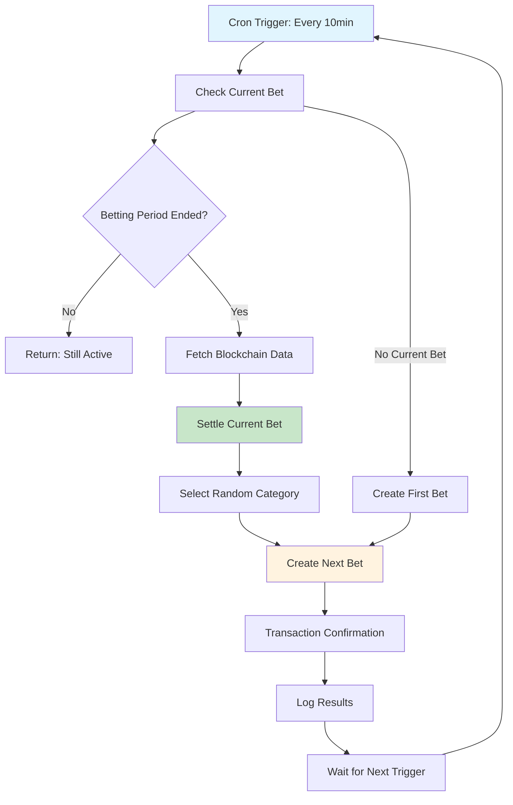

# ChainChaos Automation System

## 🎯 Overview

The ChainChaos automation system manages continuous 10-minute prediction rounds on Etherlink. Instead of manual bet creation and settlement, this system:

1. **Automatically settles** completed betting rounds
2. **Fetches real blockchain data** for settlement 
3. **Creates new rounds** with random categories
4. **Maintains continuous operation** with configurable timing

## 🏗️ Architecture

### Single-Bet System
- **One active bet** at any time
- **Automatic 10-minute cycles** (configurable)
- **Random category selection** from predefined pool
- **Seamless transitions** between rounds

### Automation Options

#### Option 1: FaaS (Recommended) ✅
**Pros:**
- ✅ **No infrastructure management**
- ✅ **Cost-effective** (pay per execution)
- ✅ **Auto-scaling**
- ✅ **Easy deployment** (Vercel, AWS Lambda)
- ✅ **Built-in monitoring**

**Cons:**
- ❌ **Cold starts** (minimal impact)
- ❌ **Platform vendor lock-in**

#### Option 2: Dedicated Service
**Pros:**
- ✅ **Full control**
- ✅ **No cold starts**
- ✅ **Platform independent**

**Cons:**
- ❌ **Infrastructure management**
- ❌ **Higher costs**
- ❌ **Scaling complexity**

### **Recommendation: FaaS (Vercel Functions)**

## 📊 Betting Categories

The system randomly selects from these prediction categories:

| Category | Description | Currency | Amount | Data Source |
|----------|-------------|----------|--------|-------------|
| **Gas Price** | Average gas price prediction | XTZ | 0.1 | `provider.getFeeData()` |
| **Block Count** | Blocks mined in 10 minutes | USDC | 1.0 | Block time calculation |
| **Transaction Count** | Total transactions | USDC | 2.0 | Block transaction analysis |
| **Network Activity** | Activity score (0-100) | XTZ | 0.05 | Gas usage ratio |

## 🔧 Smart Contract Updates

### New Functions Added:

```solidity
// Get current active bet
function getCurrentBet() external view returns (BetInfo)

// Check if betting is active
function isBettingActive() external view returns (bool)

// Automated settlement + creation
function settleBetAndCreateNext(
    uint256 actualValue,
    string nextCategory,
    string nextDescription,
    uint8 nextCurrencyType,
    uint256 nextBetAmount,
    uint256 nextStartTime,
    uint256 nextEndTime
) external onlyOracle

// Create automated bet with timing
function createAutomatedBet(
    string category,
    string description,
    uint8 currencyType,
    uint256 betAmount,
    uint256 startTime,
    uint256 endTime
) external onlyOracle returns (uint256)

// Configure system
function setOracle(address _oracle) external onlyOwner
function setBetDuration(uint256 _duration) external onlyOwner
```

### Updated Bet Structure:
```solidity
struct Bet {
    // ... existing fields ...
    uint256 startTime;  // When betting starts
    uint256 endTime;    // When betting ends
}
```

## 🚀 Deployment Guide

### 1. Environment Setup

```bash
# Required environment variables
CHAIN_ID=128123                           # Etherlink Testnet
ORACLE_PRIVATE_KEY=0x...                  # Oracle wallet private key
CHAINCHAOS_ADDRESS_TESTNET=0x...          # Contract address
USDC_ADDRESS_TESTNET=0x...                # USDC contract address
CHAINCHAOS_ADDRESS_MAINNET=0x...          # Mainnet contracts
USDC_ADDRESS_MAINNET=0x...
```

### 2. Vercel Deployment (Recommended)

```bash
# Install Vercel CLI
npm i -g vercel

# Deploy to Vercel
cd automation
npm install
vercel --prod

# Configure environment variables in Vercel dashboard
vercel env add ORACLE_PRIVATE_KEY
vercel env add CHAINCHAOS_ADDRESS_TESTNET
# ... add all required variables
```

### 3. AWS Lambda Deployment

```bash
# Install Serverless Framework
npm i -g serverless

# Deploy to AWS
cd automation
npm install
serverless deploy --stage prod
```

### 4. Local Testing

```bash
cd automation
npm install

# Set environment variables
export CHAIN_ID=128123
export ORACLE_PRIVATE_KEY=0x...
export CHAINCHAOS_ADDRESS_TESTNET=0x...

# Test the automation
node betting-cron.js
```

## 📱 Frontend Updates

### New Components:

#### **CurrentBet.tsx**
- Displays active betting round
- **Real-time countdown timer**
- Navigation to history
- Betting status indicators

#### **BetHistory.tsx**
- Shows past prediction rounds
- **Unclaimed rewards notifications**
- Tabbed interface (Recent / Rewards)
- Claiming functionality

### Key Features:
- ⏰ **Live countdown timers**
- 🏆 **Reward notifications**
- 📊 **Round history**
- 🔄 **Seamless navigation**
- 💰 **Prize claiming**

## 🔄 Automation Flow



## 📊 Monitoring & Health

### Health Check Endpoint
```bash
GET /api/health

Response:
{
  "healthy": true,
  "blockNumber": 12345,
  "oracleBalance": "1.5",
  "chainId": 128123
}
```

### Cycle Execution
```bash
POST /api/cycle

Response:
{
  "success": true,
  "message": "Bet settled and next bet created",
  "txHash": "0x...",
  "settledBet": "123",
  "nextCategory": "gas_price"
}
```

## ⚙️ Configuration

### Timing Configuration
```javascript
// In smart contract
await contract.setBetDuration(15 * 60) // 15 minutes

// In automation script
const BET_DURATION = 15 * 60 // seconds
```

### Category Weights
```javascript
// Add weight property for biased selection
const BET_CATEGORIES = [
  { id: 'gas_price', weight: 3 },    // 3x more likely
  { id: 'block_count', weight: 2 },  // 2x more likely  
  { id: 'activity_score', weight: 1 } // baseline
]
```

## 🔐 Security Considerations

### Oracle Wallet
- **Dedicated wallet** for automation only
- **Minimum required balance** (for gas)
- **Private key security** (environment variables)
- **Regular balance monitoring**

### Access Control
- **onlyOracle modifier** restricts automation functions
- **Owner can change oracle** address
- **Oracle cannot change ownership**

### Fallback Mechanisms
- **Health check endpoints** for monitoring
- **Manual override** capabilities
- **Error logging** and alerting

## 📈 Future Enhancements

### Advanced Data Sources
- **External APIs** (price feeds, weather, etc.)
- **Cross-chain data** via oracles
- **User-submitted categories**
- **Dynamic difficulty adjustment**

### Smart Features
- **Participation-based timing** (extend if low participation)
- **Dynamic bet amounts** based on pot size
- **Bonus rounds** and special events
- **Leaderboards** and achievements

## 🎮 User Experience

### Continuous Engagement
- **Always an active round** to join
- **Predictable timing** (every 10 minutes)
- **Variety in categories** keeps it interesting
- **Quick rounds** = instant gratification

### Reward System
- **Immediate settlement** after rounds end
- **Clear claiming interface** for rewards
- **Historical tracking** of performance
- **Multiple currency options**

## 🚀 Getting Started

1. **Deploy contracts** with new automation functions
2. **Set up FaaS automation** (Vercel recommended)
3. **Configure oracle wallet** and permissions
4. **Update frontend** with new components
5. **Test end-to-end flow** on testnet
6. **Monitor and optimize** based on usage

This system transforms ChainChaos from a manual prediction market into a **fully automated, continuous gaming experience** that runs 24/7 without intervention! 🎉 